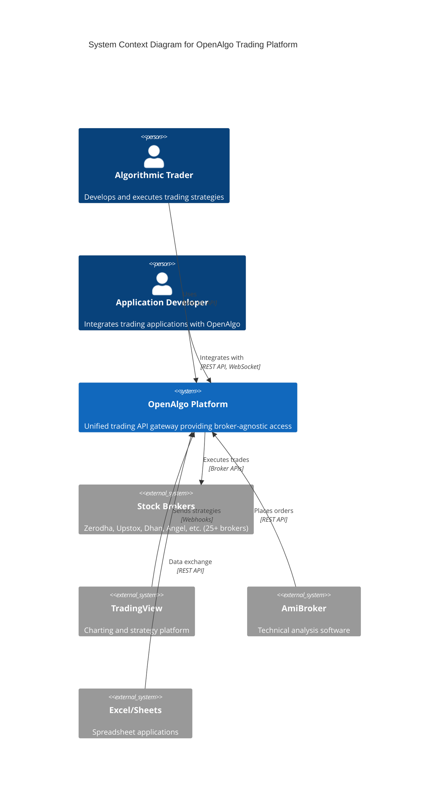
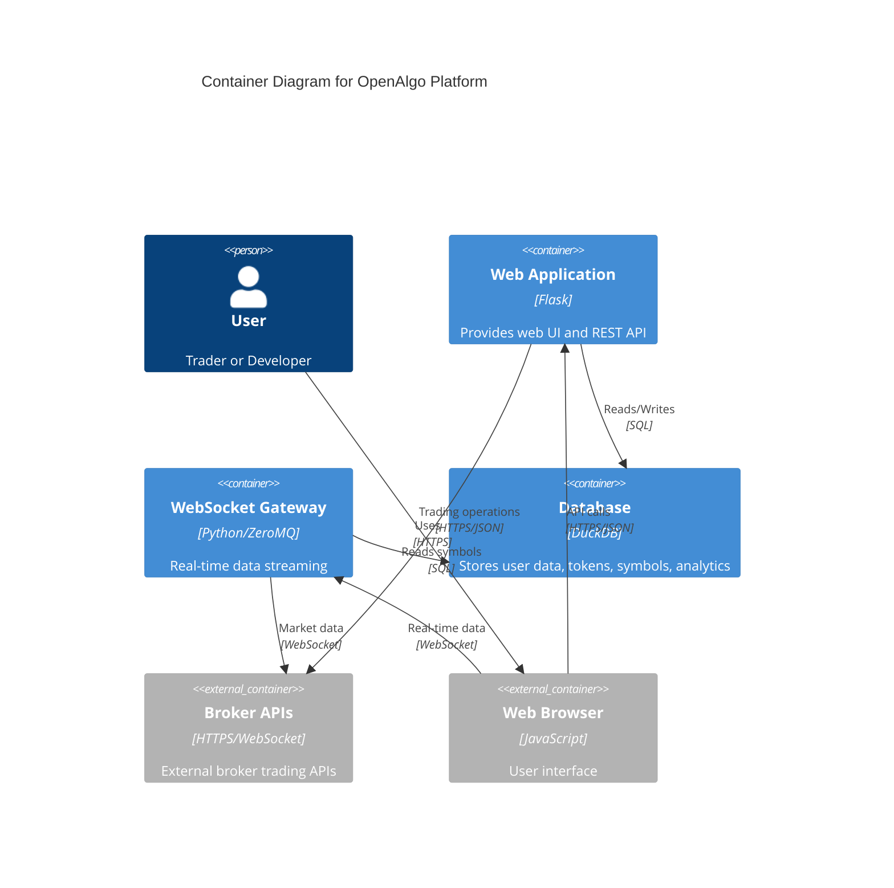
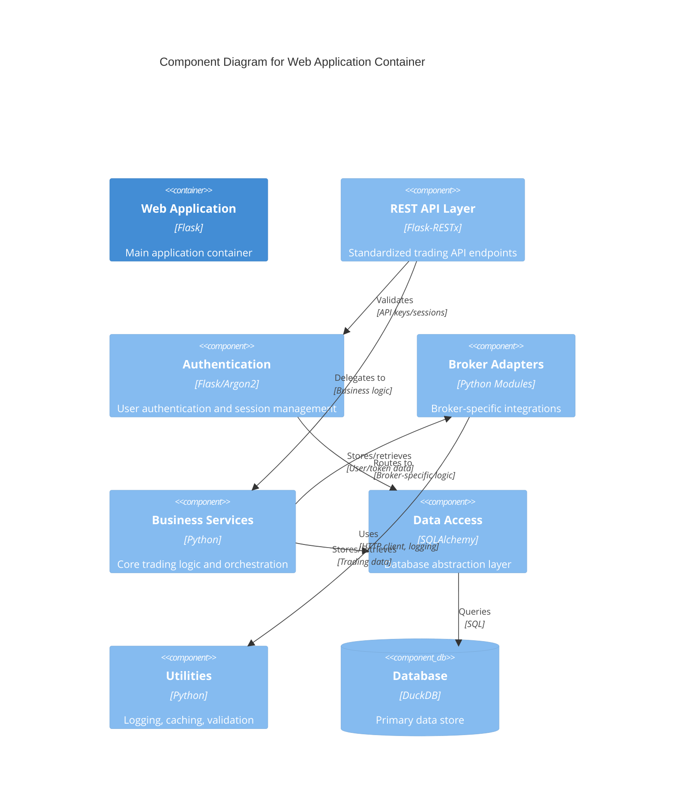
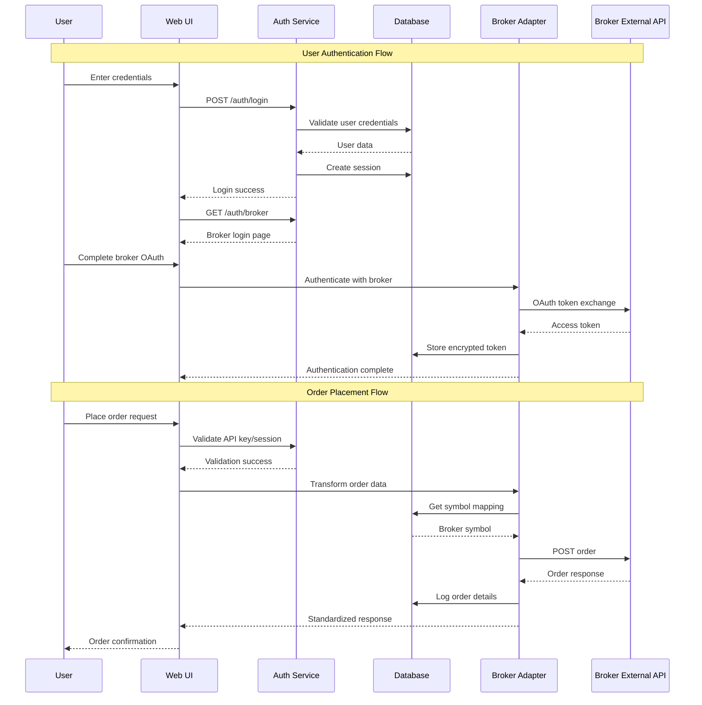
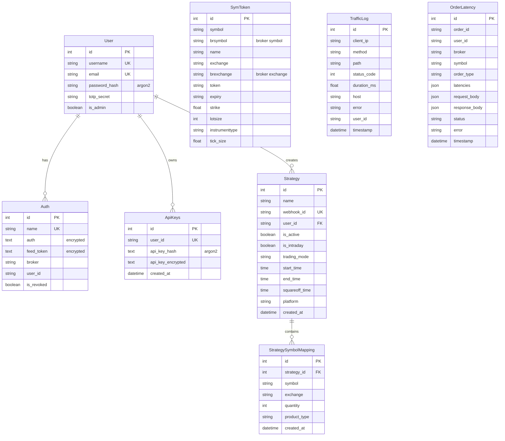

# OpenAlgo Codebase Architecture Analysis

## 1. High-Level Summary

### Primary Technologies
- **Programming Languages**: Python 3.12+ (primary), JavaScript (frontend), CSS/HTML
- **Web Framework**: Flask 3.0.3 with Flask-RESTx for API documentation
- **Database**: DuckDB 1.2.2 (primary), SQLite (alternative/legacy support)
- **Real-time Communication**: WebSocket proxy server with ZeroMQ messaging
- **Authentication**: Argon2 password hashing, TOTP-based 2FA, encrypted token storage
- **Containerization**: Docker with Docker Compose
- **Frontend**: Vanilla JavaScript with TailwindCSS/DaisyUI components

### Application Purpose
OpenAlgo is a **unified trading platform API gateway** that provides standardized access to 25+ Indian stock brokers through a single, consistent REST API interface. It acts as an abstraction layer that normalizes different broker APIs into a common format, enabling algorithmic trading applications to work across multiple brokers without code changes.

### Architectural Style
**Modular Monolithic Architecture** with **Plugin-based Broker Integration**:
- Centralized Flask application with modular broker plugins
- API Gateway pattern for broker abstraction
- Event-driven WebSocket streaming for real-time data
- Layered architecture with clear separation of concerns

## 2. Core Components & Responsibilities

### Main Application Layer
- **[`app.py`](app.py:1)**: Main Flask application entry point, handles routing, middleware, and application initialization
- **[`extensions.py`](extensions.py:1)**: Flask extensions configuration (CORS, CSP, rate limiting)
- **[`limiter.py`](limiter.py:1)**: Rate limiting configuration and rules
- **[`cors.py`](cors.py:1)** & **[`csp.py`](csp.py:1)**: Security middleware configuration

### API Layer
- **[`restx_api/`](restx_api/)**: Flask-RESTx API documentation and Swagger UI setup
- **[`blueprints/`](blueprints/)**: API endpoint definitions organized by functionality
  - Authentication, Orders, Portfolio, Holdings, Positions, Market Data, etc.

### Broker Integration Layer
- **[`broker/`](broker/)**: Modular broker implementations (25+ brokers including Zerodha, Upstox, Dhan, etc.)
  - Each broker has standardized structure: `api/`, `database/`, `mapping/`, `streaming/`
  - **API**: Broker-specific API integration logic
  - **Database**: Broker authentication and session management
  - **Mapping**: Data transformation between broker formats and OpenAlgo standard
  - **Streaming**: Real-time data feed integration

### Database Layer
- **[`database/`](database/)**: SQLAlchemy-based data models and access layer
  - **Authentication & Users**: [`auth_db.py`](database/auth_db.py:1), [`user_db.py`](database/user_db.py:1)
  - **Market Data**: [`symbol.py`](database/symbol.py:1), [`token_db.py`](database/token_db.py:1)
  - **Analytics & Monitoring**: [`traffic_db.py`](database/traffic_db.py:1), [`latency_db.py`](database/latency_db.py:1)
  - **Strategy Management**: [`strategy_db.py`](database/strategy_db.py:1), [`chartink_db.py`](database/chartink_db.py:1)

### Services Layer
- **[`services/`](services/)**: Business logic and orchestration services
- **[`utils/`](utils/)**: Utility functions, logging, session management, plugins

### WebSocket & Real-time Layer
- **[`websocket_proxy/`](websocket_proxy/)**: WebSocket proxy server for real-time data streaming
- **[`extensions.py`](extensions.py:1)**: Flask-SocketIO integration

## 3. Data Management

### Data Persistence Strategy
**Primary Database**: DuckDB for high-performance analytical queries and time-series data
**Alternative**: SQLite for lightweight deployments
**Connection Pooling**: Configured with 50 base connections, 100 max overflow

### Primary Data Models

#### Authentication & User Management
- **Users**: [`User`](database/user_db.py:38) - User accounts with Argon2 hashed passwords and TOTP secrets
- **Auth Tokens**: [`Auth`](database/auth_db.py:60) - Encrypted broker authentication tokens with revocation support
- **API Keys**: [`ApiKeys`](database/auth_db.py:70) - Hashed and encrypted API keys for programmatic access

#### Market Data & Symbols
- **Symbol Tokens**: [`SymToken`](database/symbol.py:21) - Master contract data with enhanced search capabilities
- **Token Mapping**: Broker-specific symbol mappings and conversions

#### Trading & Strategy Data
- **Strategies**: [`Strategy`](database/strategy_db.py:23) - Trading strategy definitions with time-based controls
- **Chartink Integration**: [`ChartinkStrategy`](database/chartink_db.py:23) - External strategy integrations

#### Monitoring & Analytics
- **Traffic Logs**: [`TrafficLog`](database/traffic_db.py:25) - Request/response monitoring
- **Latency Tracking**: [`OrderLatency`](database/latency_db.py:25) - End-to-end order execution timing
- **API Analytics**: [`AnalyzerLog`](database/analyzer_db.py:29) - Request validation and testing logs

### Data Flow for Order Execution
1. **API Request** → Rate limiting & authentication validation
2. **Symbol Mapping** → OpenAlgo format to broker-specific format
3. **Broker Integration** → Dynamic module loading and API call
4. **Response Transformation** → Broker format back to OpenAlgo standard
5. **Logging & Analytics** → Performance tracking and audit trails

## 4. Dependencies and Integrations

### Key External Dependencies
- **Web Framework**: Flask 3.0.3, Flask-RESTx 1.3.0, Flask-SocketIO 5.3.6
- **Database**: DuckDB 1.2.2, SQLAlchemy 2.0.31
- **Security**: Argon2-cffi 23.1.0, Cryptography 44.0.1, PyJWT 2.8.0
- **HTTP Client**: HTTPX 0.28.1 with HTTP/2 support
- **Real-time**: ZeroMQ, WebSockets 15.0.1
- **Data Processing**: Pandas 2.2.3, NumPy 2.2.4

### Internal Dependencies and Communication Patterns

#### Dynamic Module Loading
- **Plugin Architecture**: [`utils/plugin_loader.py`](utils/plugin_loader.py:10) dynamically loads broker modules
- **Runtime Discovery**: Broker authentication functions loaded at startup

#### Inter-Component Communication
- **Synchronous**: Direct function calls within Flask request context
- **Asynchronous**: Background task processing for analytics and logging
- **Real-time**: WebSocket connections for live market data streaming

#### Broker Integration Pattern
- **Adapter Pattern**: Each broker implements standard interface
- **Data Transformation**: [`broker/{broker}/mapping/`](broker/) modules handle format conversion
- **Authentication Flow**: OAuth2/API key flows abstracted per broker

## 5. Architectural Diagrams

### C4 Model: System Context Diagram

### C4 Model: Container Diagram

### Component Diagram for Web Application Container

### Sequence Diagram: User Login and Order Placement

### Entity-Relationship Diagram for Core Data Models

## 6. Security Architecture

### Authentication Mechanisms
1. **Multi-Factor Authentication**:
   - Primary: Username/password with Argon2 hashing + pepper
   - Secondary: TOTP-based 2FA for password resets
   - Session management with IST timezone-based expiry (3:30 AM default)

2. **API Authentication**:
   - Argon2-hashed API keys with pepper for verification
   - Encrypted API key storage for retrieval
   - Rate limiting per API key and endpoint

3. **Broker Authentication**:
   - OAuth2 flows for supported brokers
   - API key/secret pairs stored encrypted with Fernet
   - Automatic token revocation on session expiry

### Security Controls
1. **Transport Security**:
   - HTTPS enforcement for production environments
   - Secure cookie configuration with `__Secure-` prefix
   - CSRF protection with secure token management

2. **Input Validation & Rate Limiting**:
   - Request rate limiting with configurable limits
   - Input sanitization and validation
   - SQL injection prevention through SQLAlchemy ORM

3. **Data Protection**:
   - Encryption at rest for sensitive tokens using Fernet
   - Password hashing with Argon2 and salt/pepper
   - Secure session management with automatic expiry

### Access Control
- Role-based access control (admin/user roles)
- API key-based access for programmatic usage
- Session-based access for web interface
- Broker-specific token isolation per user

## 7. Performance & Scalability Considerations

### Database Optimization
- Connection pooling (50 base, 100 max overflow)
- Composite indices on frequently queried columns
- TTL caching for auth tokens and broker data
- DuckDB for high-performance analytical queries

### HTTP Performance
- HTTP/2 support with HTTPX client
- Connection pooling for broker API calls
- Asynchronous request processing where possible
- Response compression and caching headers

### Real-time Data Handling
- WebSocket connections for live market data
- ZeroMQ for internal message passing
- Separate proxy server for WebSocket handling
- Event-driven architecture for real-time updates

This architecture analysis reveals OpenAlgo as a sophisticated, security-focused trading platform that successfully abstracts the complexity of multiple broker APIs while providing a unified interface for algorithmic trading applications. The modular design enables easy broker integration and maintenance while ensuring robust security and performance characteristics.