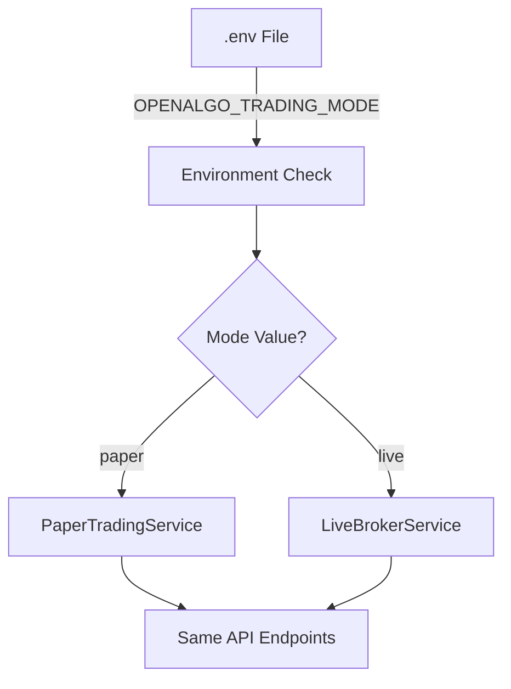

# 🔄 Trading Mode Switch Guide

## 📍 **Where is the Switch?**

The trading mode switch is controlled by the **`OPENALGO_TRADING_MODE`** environment variable in your **`.env`** file.

### 🔧 **Location of the Switch**

```
📁 OpenAlgo Root Directory/
├── .env                    ← THE SWITCH IS HERE!
├── .sample.env
├── app.py
└── ... other files
```

## 🎛️ **How the Switch Works**

### **Current Mode Detection**
The switch works through these mechanisms:

1. **Environment Variable**: `OPENALGO_TRADING_MODE` in `.env` file
2. **Factory Pattern**: `TradingServiceFactory` reads the variable
3. **Service Selection**: Returns appropriate implementation (Paper vs Live)
4. **API Transparency**: All endpoints work identically in both modes



## 🔄 **How to Switch Modes**

### **Method 1: Edit .env File Directly**

1. **Open your `.env` file** in a text editor
2. **Find the line**: `OPENALGO_TRADING_MODE=live`
3. **Change it to**: `OPENALGO_TRADING_MODE=paper` (or vice versa)
4. **Save the file**
5. **Restart the application**

### **Method 2: PowerShell Commands**

```powershell
# Stop the application first (Ctrl+C)

# Switch to Paper Trading
(Get-Content .env) -replace 'OPENALGO_TRADING_MODE=live', 'OPENALGO_TRADING_MODE=paper' | Set-Content .env

# Switch to Live Trading  
(Get-Content .env) -replace 'OPENALGO_TRADING_MODE=paper', 'OPENALGO_TRADING_MODE=live' | Set-Content .env

# Restart application
python app.py
```

## 📋 **Complete Switch Procedure**

### **🟢 Switching to Paper Trading (Safe)**

```bash
# 1. Stop OpenAlgo application (Ctrl+C)

# 2. Edit .env file
OPENALGO_TRADING_MODE=paper
PAPER_DEFAULT_BALANCE=50000.00
PAPER_DEFAULT_CURRENCY=INR

# 3. Restart application
python app.py

# 4. Verify switch worked
curl -X GET "http://localhost:5000/api/v1/trading_mode"
```

**Expected Response:**
```json
{
  "status": "success",
  "trading_mode": "paper",
  "is_paper_trading": true,
  "message": "Currently in PAPER trading mode",
  "warning": "⚠️ No real money will be used in paper trading mode"
}
```

### **🔴 Switching to Live Trading (DANGER - Real Money!)**

```bash
# 1. Stop OpenAlgo application (Ctrl+C)

# 2. Edit .env file
OPENALGO_TRADING_MODE=live

# 3. Restart application
python app.py

# 4. Verify switch worked
curl -X GET "http://localhost:5000/api/v1/trading_mode"
```

**Expected Response:**
```json
{
  "status": "success",
  "trading_mode": "live",
  "is_live_trading": true,
  "message": "Currently in LIVE trading mode",
  "warning": "⚠️ CAUTION: Real money trading is active!"
}
```

## 🌐 **API Endpoints for Mode Management**

### **1. Check Current Mode**
```bash
GET /api/v1/trading_mode
```
- No authentication required
- Returns current mode and configuration

### **2. Check User-Specific Mode**
```bash
POST /api/v1/trading_mode/check
Content-Type: application/json

{
  "apikey": "your_api_key_here"
}
```
- Requires valid API key
- Returns user-specific information and paper account stats

### **3. Get Switch Instructions**
```bash
GET /api/v1/trading_mode/switch_info
```
- Returns step-by-step instructions for switching modes
- Includes warnings and examples

### **4. Clear Service Cache** (Advanced)
```bash
POST /api/v1/trading_mode/clear_cache
Content-Type: application/json

{
  "apikey": "your_api_key_here"
}
```
- Clears internal service cache
- Useful when troubleshooting mode switches

## 🔍 **Visual Indicators**

### **Application Startup Messages**

**Paper Trading Mode:**
```
📄 Paper Trading Mode Enabled
   Default Balance: 50000.00 INR
   Database URL: sqlite:///db/paper_trading.db
   ⚠️  No real money will be used - this is simulation mode
```

**Live Trading Mode:**
```
💰 Live Trading Mode Enabled
   ⚠️  CAUTION: Real money trading is active!
```

### **API Response Indicators**

All API responses in paper trading mode include mode indicators:
```json
{
  "status": "success",
  "orderid": "PT123456789ABC",  // "PT" prefix = Paper Trading
  "message": "Paper trading order placed successfully"
}
```

## ⚙️ **Behind the Scenes: How It Works**

### **1. Environment Loading** (`utils/env_check.py`)
```python
# Validates OPENALGO_TRADING_MODE at startup
trading_mode = os.getenv('OPENALGO_TRADING_MODE', 'live').lower().strip()
if trading_mode not in ['live', 'paper']:
    print("Error: Invalid OPENALGO_TRADING_MODE")
    sys.exit(1)
```

### **2. Service Factory** (`services/trading_service_factory.py`)
```python
# Selects appropriate service based on mode
def get_trading_service(user_id: str, broker: str) -> ITradingService:
    trading_mode = os.getenv('OPENALGO_TRADING_MODE', 'live').lower()
    
    if trading_mode == 'paper':
        return PaperTradingService(user_id, broker)
    else:
        return LiveBrokerService(user_id, broker)
```

### **3. Service Integration** (`services/place_order_service.py`)
```python
# Existing services use factory transparently
from services.trading_service_factory import get_trading_service

# No code changes needed - factory handles the switch
trading_service = get_trading_service(user_id, broker)
success, response, status = trading_service.place_order(order_data, auth_token)
```

## 🔒 **Safety Features**

### **1. Data Isolation**
- **Paper Trading Database**: `sqlite:///db/paper_trading.db`
- **Live Trading Database**: `sqlite:///db/openalgo.db`
- **Complete Separation**: No mixing of data between modes

### **2. Clear Mode Indicators**
- **Startup Messages**: Clear visual confirmation of current mode
- **API Responses**: Mode indicators in all responses
- **Order IDs**: Different prefixes (PT for Paper, broker-specific for Live)

### **3. Validation**
- **Environment Check**: Validates mode value at startup
- **Default Fallback**: Defaults to 'live' if variable not set
- **Error Handling**: Clear error messages for invalid configurations

## 🚨 **Important Warnings**

### **⚠️ When Switching to Live Mode**
1. **Real Money Risk**: Live mode uses actual money
2. **Test First**: Always test strategies in paper mode thoroughly
3. **Risk Management**: Ensure proper position sizing and stop losses
4. **Account Balance**: Verify sufficient funds in broker account

### **⚠️ When Switching to Paper Mode**
1. **Simulation Only**: No real trades will be executed
2. **Different Database**: Paper trading data is separate
3. **Reset Available**: Can reset paper account anytime
4. **Learning Tool**: Good for education and strategy testing

## 🛠️ **Troubleshooting**

### **Switch Not Working?**

1. **Check .env File**:
   ```bash
   # View current content
   Get-Content .env | Select-String "OPENALGO_TRADING_MODE"
   ```

2. **Verify Restart**:
   - Ensure application was completely stopped and restarted
   - Environment variables are loaded only at startup

3. **Check Logs**:
   - Look for startup messages indicating current mode
   - Check for any validation errors

4. **API Verification**:
   ```bash
   curl -X GET "http://localhost:5000/api/v1/trading_mode"
   ```

### **Common Issues**

1. **Typo in Variable Name**: Must be exactly `OPENALGO_TRADING_MODE`
2. **Case Sensitivity**: Values should be lowercase (`paper` or `live`)
3. **Not Restarting**: Changes require application restart
4. **Wrong File**: Make sure editing the correct `.env` file

## 📝 **Summary**

The trading mode switch is a simple but powerful environment variable:

```bash
# The Switch Location
File: .env
Variable: OPENALGO_TRADING_MODE
Values: live | paper
Default: live
Restart Required: Yes
```

**To Switch**: Edit `.env` → Change variable → Restart app → Verify with API

This design ensures safe, transparent switching between live and paper trading modes while maintaining complete data isolation and API compatibility.