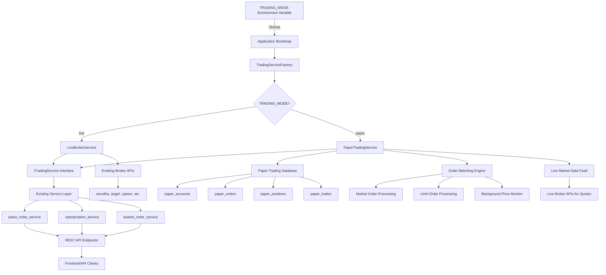
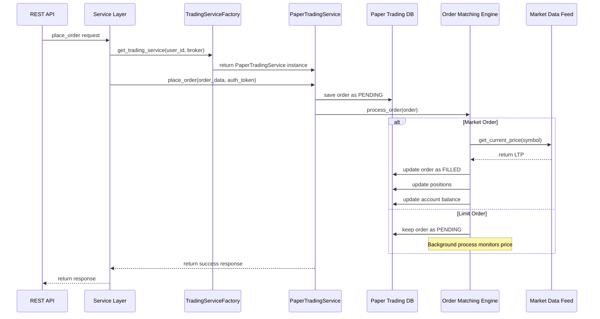
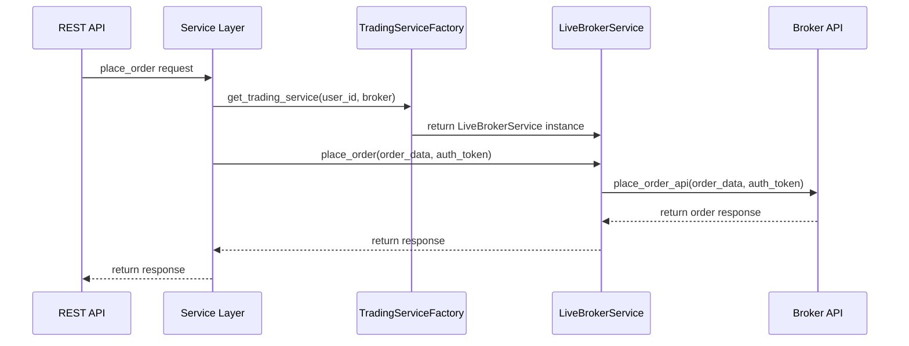

# Paper Trading Module - Architectural Blueprint

## 🏗️ **Architecture Overview**

Based on analysis of the OpenAlgo application, this blueprint provides a seamless paper trading module that can be toggled via a single environment variable (`TRADING_MODE=paper` or `TRADING_MODE=live`) without modifying existing business logic.

## **High-Level Architecture Diagram**



## **Core Architectural Principles**

1. **✅ Transparent Abstraction**: The `ITradingService` interface ensures that services like `place_order_service.py` remain completely unaware of trading mode
2. **✅ Data Source Segregation**: Live market data for both modes, but account/trade data separated by implementation
3. **✅ Non-Invasive Integration**: Uses dependency injection factory pattern - zero changes to existing API endpoints
4. **✅ Stateful Simulation**: SQLite database persists all paper trading state between restarts

## **Component Specifications**

### **1. ITradingService Interface**
```python
# services/interfaces/trading_service.py
from abc import ABC, abstractmethod
from typing import Dict, Any, Tuple

class ITradingService(ABC):
    """Abstract interface for trading services"""
    
    @abstractmethod
    def place_order(self, order_data: Dict[str, Any], auth_token: str) -> Tuple[bool, Dict[str, Any], int]:
        """Place a trading order"""
        pass
    
    @abstractmethod
    def get_positions(self, auth_token: str) -> Tuple[bool, Dict[str, Any], int]:
        """Get current positions"""
        pass
    
    @abstractmethod  
    def get_open_orders(self, auth_token: str) -> Tuple[bool, Dict[str, Any], int]:
        """Get open orders"""
        pass
    
    @abstractmethod
    def get_trade_history(self, auth_token: str) -> Tuple[bool, Dict[str, Any], int]:
        """Get trade history"""
        pass
    
    @abstractmethod
    def cancel_order(self, order_id: str, auth_token: str) -> Tuple[bool, Dict[str, Any], int]:
        """Cancel an order"""
        pass
    
    @abstractmethod
    def get_account_balance(self, auth_token: str) -> Tuple[bool, Dict[str, Any], int]:
        """Get account balance"""
        pass
```

### **2. TradingServiceFactory**
```python
# services/trading_service_factory.py
import os
from typing import Dict
from services.interfaces.trading_service import ITradingService

class TradingServiceFactory:
    """Factory for creating appropriate trading service instances"""
    
    _instances: Dict[str, ITradingService] = {}
    
    @classmethod
    def get_trading_service(cls, user_id: str, broker: str) -> ITradingService:
        """Get appropriate trading service based on TRADING_MODE"""
        
        cache_key = f"{user_id}_{broker}"
        if cache_key in cls._instances:
            return cls._instances[cache_key]
        
        trading_mode = os.getenv('TRADING_MODE', 'live').lower()
        
        if trading_mode == 'paper':
            from services.paper_trading_service import PaperTradingService
            instance = PaperTradingService(user_id, broker)
        else:
            from services.live_broker_service import LiveBrokerService
            instance = LiveBrokerService(user_id, broker)
        
        cls._instances[cache_key] = instance
        return instance
```

### **3. Database Schema**
```sql
-- Paper Trading Database Schema
CREATE TABLE paper_accounts (
    id INTEGER PRIMARY KEY AUTOINCREMENT,
    user_id VARCHAR(255) NOT NULL UNIQUE,
    initial_balance DECIMAL(15,2) DEFAULT 50000.00,
    current_balance DECIMAL(15,2) NOT NULL,
    currency VARCHAR(3) DEFAULT 'INR',
    created_at TIMESTAMP DEFAULT CURRENT_TIMESTAMP,
    updated_at TIMESTAMP DEFAULT CURRENT_TIMESTAMP
);

CREATE TABLE paper_orders (
    id INTEGER PRIMARY KEY AUTOINCREMENT,
    user_id VARCHAR(255) NOT NULL,
    order_id VARCHAR(50) NOT NULL UNIQUE,
    symbol VARCHAR(50) NOT NULL,
    exchange VARCHAR(20) NOT NULL,
    action VARCHAR(10) NOT NULL, -- BUY/SELL
    product VARCHAR(20) NOT NULL, -- MIS/CNC/NRML
    price_type VARCHAR(20) NOT NULL, -- MARKET/LIMIT/SL/SLM
    quantity INTEGER NOT NULL,
    price DECIMAL(10,2),
    trigger_price DECIMAL(10,2),
    status VARCHAR(20) DEFAULT 'PENDING', -- PENDING/FILLED/CANCELLED
    filled_quantity INTEGER DEFAULT 0,
    average_price DECIMAL(10,2),
    created_at TIMESTAMP DEFAULT CURRENT_TIMESTAMP,
    updated_at TIMESTAMP DEFAULT CURRENT_TIMESTAMP,
    FOREIGN KEY (user_id) REFERENCES paper_accounts(user_id)
);

CREATE TABLE paper_positions (
    id INTEGER PRIMARY KEY AUTOINCREMENT,
    user_id VARCHAR(255) NOT NULL,
    symbol VARCHAR(50) NOT NULL,
    exchange VARCHAR(20) NOT NULL,
    product VARCHAR(20) NOT NULL,
    quantity INTEGER NOT NULL,
    average_price DECIMAL(10,2) NOT NULL,
    updated_at TIMESTAMP DEFAULT CURRENT_TIMESTAMP,
    UNIQUE(user_id, symbol, exchange, product),
    FOREIGN KEY (user_id) REFERENCES paper_accounts(user_id)
);

CREATE TABLE paper_trades (
    id INTEGER PRIMARY KEY AUTOINCREMENT,
    user_id VARCHAR(255) NOT NULL,
    order_id VARCHAR(50) NOT NULL,
    trade_id VARCHAR(50) NOT NULL UNIQUE,
    symbol VARCHAR(50) NOT NULL,
    exchange VARCHAR(20) NOT NULL,
    action VARCHAR(10) NOT NULL,
    quantity INTEGER NOT NULL,
    price DECIMAL(10,2) NOT NULL,
    trade_value DECIMAL(15,2) NOT NULL,
    created_at TIMESTAMP DEFAULT CURRENT_TIMESTAMP,
    FOREIGN KEY (user_id) REFERENCES paper_accounts(user_id),
    FOREIGN KEY (order_id) REFERENCES paper_orders(order_id)
);
```

### **4. Integration Example**

Here's how existing services will be updated:

```python
# services/place_order_service.py - Updated integration
from services.trading_service_factory import TradingServiceFactory
from database.auth_db import get_user_id_from_token  # Existing function

def place_order_with_auth(
    order_data: Dict[str, Any], 
    auth_token: str, 
    broker: str,
    original_data: Dict[str, Any]
) -> Tuple[bool, Dict[str, Any], int]:
    """Place an order using the trading service factory"""
    
    # Get user_id from auth_token (existing logic)
    user_id = get_user_id_from_token(auth_token)
    
    # Get appropriate trading service (paper or live)
    trading_service = TradingServiceFactory.get_trading_service(user_id, broker)
    
    # Call the service - identical for both paper and live modes
    return trading_service.place_order(order_data, auth_token)
```

## **Order Matching Engine Design**

### **Simple Price-Based Matching Logic**

```python
# services/paper_trading/order_matching_engine.py
class OrderMatchingEngine:
    """Simple order matching for paper trading"""
    
    def process_market_order(self, order: PaperOrder) -> bool:
        """Process market order - immediate fill at LTP"""
        current_price = self.get_live_market_price(order.symbol, order.exchange)
        if current_price:
            self.fill_order(order, current_price, order.quantity)
            return True
        return False
    
    def process_limit_order(self, order: PaperOrder) -> bool:
        """Process limit order - fill when price crosses limit"""
        current_price = self.get_live_market_price(order.symbol, order.exchange)
        if not current_price:
            return False
            
        # Check if limit condition is met
        if order.action == 'BUY' and current_price <= order.price:
            self.fill_order(order, order.price, order.quantity)
            return True
        elif order.action == 'SELL' and current_price >= order.price:
            self.fill_order(order, order.price, order.quantity)
            return True
            
        return False
```

## **Configuration Requirements**

### **Environment Variables**
```bash
# Core configuration
TRADING_MODE=paper  # or 'live' (default)

# Paper trading specific (optional)
PAPER_TRADING_DATABASE_URL=sqlite:///db/paper_trading.db
PAPER_DEFAULT_BALANCE=50000.00
PAPER_DEFAULT_CURRENCY=INR
```

### **Configuration Features**
- **Configurable Initial Balance**: Support for INR/USD/EUR with user-customizable amounts
- **Admin Interface**: Reset accounts, configure defaults, view statistics
- **Market Data Integration**: Uses existing broker APIs for real-time quotes

## **Benefits Summary**

1. **✅ Zero Business Logic Changes**: Existing services work unchanged
2. **✅ Seamless Mode Switching**: Single environment variable controls mode  
3. **✅ Realistic Simulation**: Live market data ensures accurate testing
4. **✅ Production Ready**: Follows OpenAlgo's existing patterns and conventions
5. **✅ Extensible Design**: Easy to add advanced features like slippage simulation later
6. **✅ Complete Integration**: Works with all existing API endpoints, UI, and external integrations

## **Data Flow Diagrams**

### **Paper Trading Mode Flow**


### **Live Trading Mode Flow**


---

This architecture provides a complete, production-ready paper trading solution that seamlessly integrates with the existing OpenAlgo application while maintaining all your specified requirements and constraints.